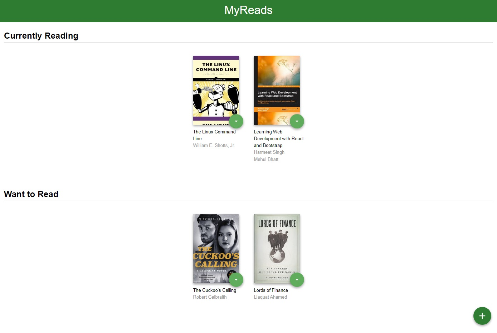
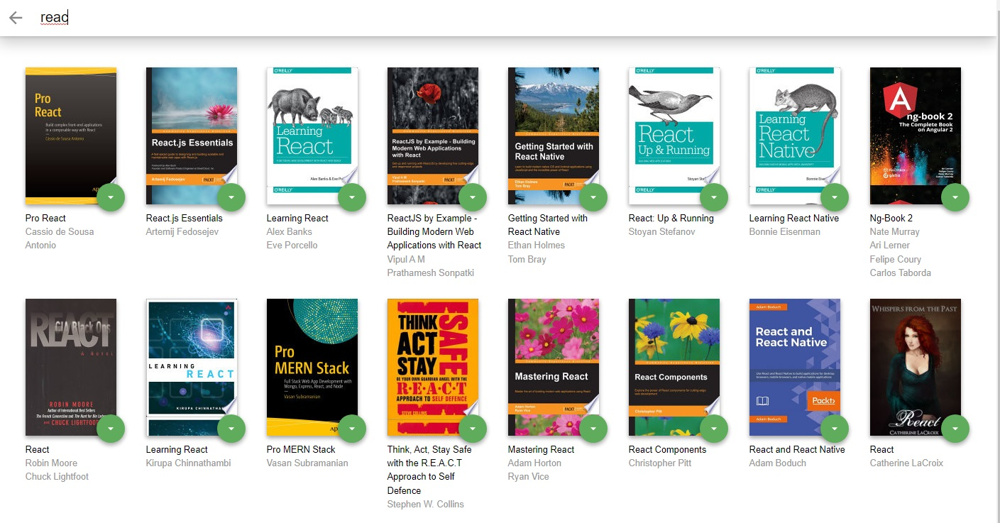

# MyReads: A Book Tracking Web App
 MyReads web app is created using React.js as a part of the Udacity's React Nanodegree program.
## Building
- [Home page] In this application, the main page displays a list of "shelves", each of which contains a number of books. The three shelves are:
-- Currently Reading
-- Want to Read
-- Read
- [Search page] The search page has a text input that may be used to find books. the books that match that query is displayed on the page, that lets you add the book to your library.

## Technologies
- HTML
- CSS
- JavaScript
- React Js
- Book Api
## Installation
To get started :
```sh
cd MyReadsApp
npm i
npm start
```

## Home Page

## Search Page



## Important
The backend API uses a fixed set of cached search results and is limited to a particular set of search terms, which can be found in [SEARCH_TERMS.md](SEARCH_TERMS.md). That list of terms are the _only_ terms that will work with the backend.

